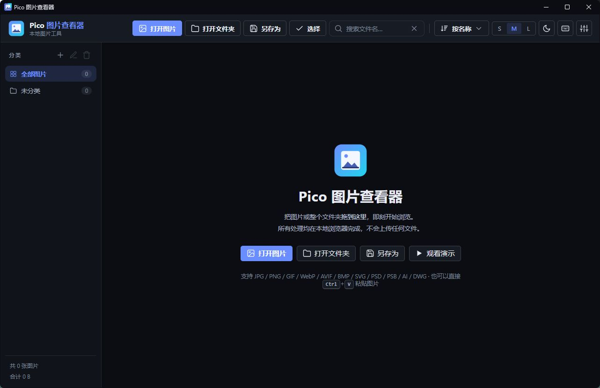
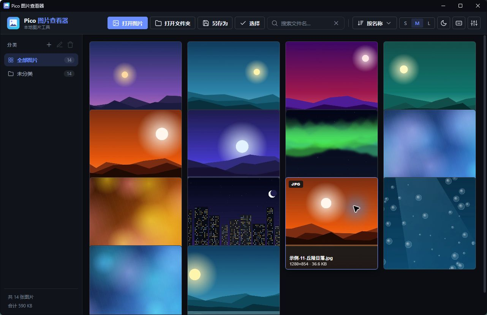
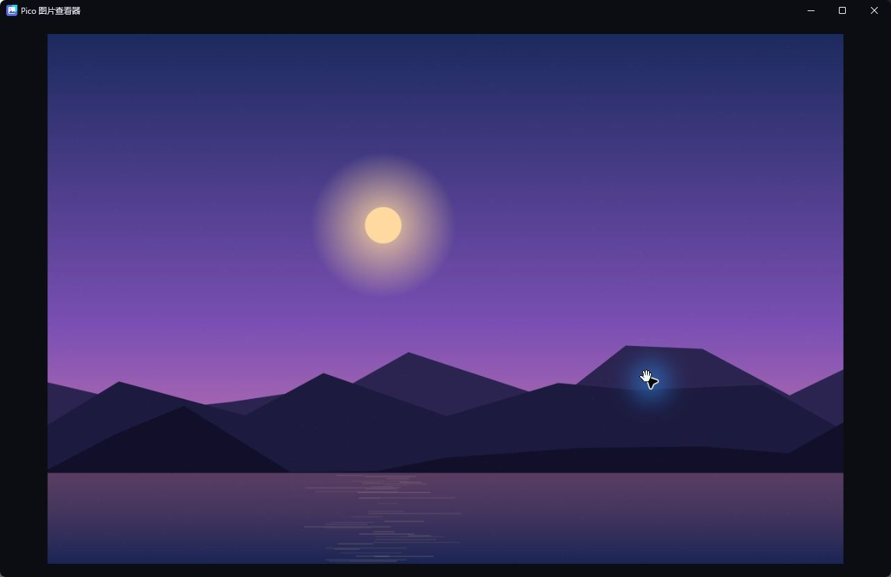
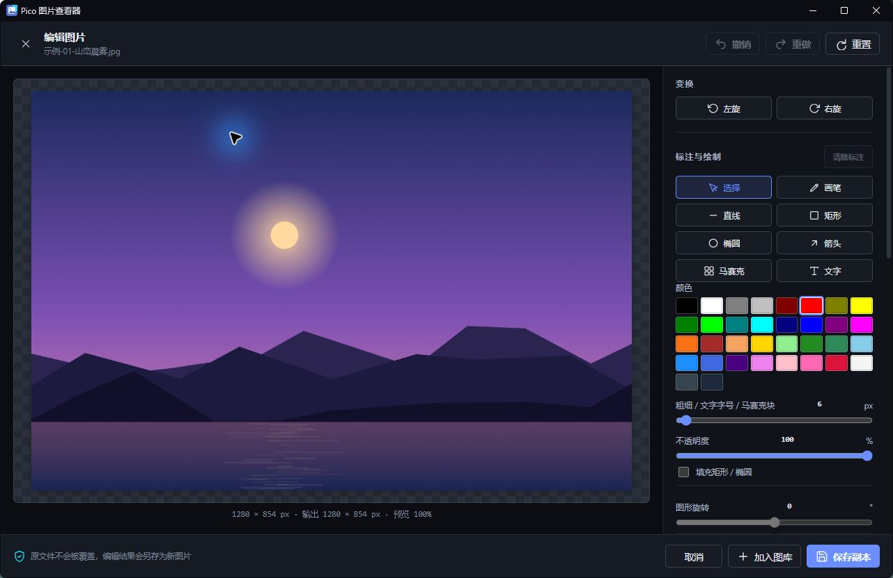

# Pico 图片查看器

> 轻量 · 极速 · 纯本地 —— 图片查看、编辑、截图一体化的 Windows 应用。

源码仓库：[github.com/moli-xia/pico](https://github.com/moli-xia/pico) · Windows 安装包：[Releases](https://github.com/moli-xia/pico/releases)

Pico 是独立维护的桌面项目，不依赖 NetUpDown 服务端；仓库根目录就是 Pico 应用本身。

## 🖼️ 界面预览

以下截图来自独立 Windows EXE 的内置演示图库：

<div align="center">
  
  
  <br />
  
  
</div>

Pico 的交付形态是**独立 Windows EXE**：HTML / CSS / JavaScript 会嵌入 EXE，由本机 WebView2 承载，不会打开网页版浏览器。它仿照当前最优秀的开源图片查看器打磨交互手感：
缩放平移的顺滑度参照 [PhotoSwipe 5](https://photoswipe.com/)（MIT），旋转工具集参照 [Viewer.js](https://github.com/fengyuanchen/viewerjs)（MIT），
键盘操作与幻灯片参照 [ImageGlass](https://github.com/d2phap/ImageGlass) / [qView](https://interversehq.com/qview/)，
网格库与文件夹浏览参照 [nomacs](https://nomacs.org/) / Eagle 的资料库体验。

所有处理均在本机完成，**任何文件都不会上传**。Windows 版的导入和文件定位由原生选择器及 Windows Shell 完成，真实绝对路径会随图库持久化。

## ✨ 功能

- **多种导入方式**：打开图片（多选）、打开文件夹（含子文件夹递归）、拖拽文件/文件夹、`Ctrl+V` 粘贴截图、一键观看内置演示
- **网格浏览**：自适应缩略图墙（S/M/L 三档，L 档使用高分辨率缩略图）、悬浮显示文件名与尺寸、分类侧栏过滤；支持新建/重命名/删除分类（删除后图片回到未分类）、把图片拖入分类、Ctrl/⌘ 点击多选、Ctrl+A 全选当前筛选结果，以及删除或批量转换所选图片
- **专业查看器**：
  - 滚轮以光标为中心缩放（可在设置中改为"切换图片"，`Ctrl+滚轮` 始终缩放）
  - 拖拽平移、双击放大/复位、触屏双指捏合
  - 旋转（90° 步进）、适应窗口 / 实际大小（1:1）、实时缩放百分比徽标
- **图片编辑器**：裁剪（自由、1:1、4:3、16:9）、旋转、亮度/对比度/饱和度/模糊/图片不透明度调整；提供画笔、直线、矩形、椭圆、箭头、马赛克和文字标注，可拖动/删除标注；图形支持按角度旋转，文字可在图片任意位置输入并双击编辑；文字字号与绘图粗细/马赛克块共用控制，所有标注共用一套标准色卡；支持自定义输出宽高、撤销、重做与重置，原文件不会被覆盖
- **另存为**：统一入口支持 PNG / JPEG / WebP 格式转换与另存，当前筛选或全部图库可批量转换后加入图库；JPEG 自动使用白色背景，GIF 动图转换为静态首帧
- **右键菜单**：对图片提供编辑、复制、粘贴、删除、查看信息、另存为和打开图片目录等常用操作；独立版会保存导入图片的真实 Windows 路径，并在资源管理器中定位并选中原文件。通过资源管理器双击/“打开方式”传给 `Pico.exe` 的图片也会自动导入并保留路径
- **快捷截图**：应用运行期间按 `Ctrl+Shift+C` 均可触发；独立 Windows 版注册全局热键，即使 Pico 最小化到任务栏也会恢复并进入截图层。立即抓取整个 Windows 屏幕并进入全屏裁剪层，拖动选择后还可拖拽边角/边缘缩放或移动选区，点击「确定」直接进入编辑器，「取消」或 `Esc` 退出。浏览器运行时回退到系统 Screen Capture API
- **幻灯片**：1–20 秒间隔、进度条指示、循环播放、空格即播
- **胶片栏**：底部缩略图条快速跳转，实时生成
- **图片信息面板**：尺寸、大小、类型、时间、所在位置，以及 **JPEG EXIF 拍摄参数**（相机、镜头、拍摄时间、曝光、光圈、ISO、焦距、闪光灯）
- **体验细节**：暗色/亮色/跟随系统主题（Windows 原生标题栏同步主题）、界面 2.8 秒自动隐藏进入沉浸模式、全屏、删除可撤销、分类和导入图库本地持久化、Toast 通知
- **格式支持**：JPG / PNG / GIF / WebP / AVIF / BMP / ICO / SVG（跟随浏览器解码能力）；PSD / PSB 使用合成图预览，AI 使用 Illustrator 保存的 PDF 兼容内容预览，DWG 使用内嵌缩略图或 LibreDWG 矢量预览
- **设计文件预览边界**：预览不会修改原文件。PSD / PSB 以合成结果为主，必要时回退到文件内嵌缩略图；`.ai` 只有在 Illustrator 中勾选“创建 PDF 兼容文件”时才能预览，默认显示第一页/第一个画板；DWG 的具体显示效果取决于文件版本、图元和是否包含 CAD 代理对象。进入编辑器后编辑的是栅格化预览，不是原生图层或 CAD 对象

## 🚀 快速开始

任选其一：

```bash
# 方式一：直接使用
双击 index.html   # 普通图片可直接打开；高级格式预览和截图建议使用 localhost 或独立版

# 方式二：Go 本地服务器（本仓库是 Go 项目，顺手提供）
go run .           # 非 Windows：启动本地服务器并自动打开浏览器

# 方式三：任意静态服务器
python -m http.server 8642
```

### 独立 Windows 应用

在仓库根目录执行：

```powershell
go run .                 # 开发运行，打开无浏览器地址栏的桌面窗口
.\build-pico.ps1         # 生成 bin\Pico.exe
```

`Pico.exe` 将 HTML / CSS / JavaScript 嵌入单个文件，并使用 Windows WebView2 显示桌面窗口；Windows 10/11 通常已自带 WebView2 Runtime。若目标机器没有运行时，Pico 会提示安装 Microsoft Edge WebView2 Runtime，不会回退成网页应用。

> 首次使用不确定？点击欢迎页的「观看演示」，应用会即时生成 14 张示例图片供体验全部功能。

## ⌨️ 快捷键

| 按键 | 功能 | 按键 | 功能 |
| --- | --- | --- | --- |
| `←` / `→` | 上一张 / 下一张 | `Home` / `End` | 第一张 / 最后一张 |
| 滚轮 | 缩放（可设置改为切换） | 双击 | 放大 / 复位 |
| `+` / `−` | 放大 / 缩小 | `0` | 适应窗口 |
| `1` | 实际大小 100% | `R` / `L` | 向右 / 向左旋转 |
| `F` | 全屏 | 空格 | 播放 / 暂停幻灯片 |
| `I` | 图片信息（EXIF） | `T` | 胶片栏 |
| `E` | 打开图片编辑器 | `O` | 另存为（含格式转换） |
| `Ctrl+Shift+C` | 截取屏幕或窗口 | `Ctrl+S` | 另存为（含格式转换） |
| `Ctrl+A` | 进入多选并全选当前筛选结果 | `Ctrl/⌘ + 点击` | 逐张切换选择状态 |
| `Delete` | 从列表移除（可撤销） | `Esc` | 返回网格 |
| `?` | 快捷键帮助 | `Ctrl+V` | 粘贴图片 |
| 拖拽 | 导入文件/文件夹 |  |  |

## 📁 目录结构

```
./
├── index.html      # 应用入口（唯一 HTML）
├── css/style.css   # 全部样式：主题变量 / 玻璃拟态 / 动效 / 响应式
├── js/
│   ├── util.js     # SVG 图标库、格式化工具、Toast、文件保存
│   ├── exif.js     # 轻量 JPEG EXIF 解析器
│   ├── demo.js     # 程序化生成演示图片（离线可用）
│   ├── formats.js  # PSD/PSB、PDF 兼容 AI、DWG 延迟加载预览引擎
│   ├── vendor/     # 已内嵌的 PSD、PDF.js、LibreDWG WebAssembly 封装
│   ├── wasm/       # LibreDWG WebAssembly 运行时
│   ├── screenshot.js # 全屏截图裁剪控制器
│   ├── viewer.js   # 全屏查看器：缩放/平移/旋转/幻灯片/信息面板
│   ├── editor.js   # Canvas 编辑器：裁剪/调整/绘图/文字/撤销重做/导出
│   ├── converter.js # PNG / JPEG / WebP 单张与批量转换
│   └── app.js      # 导入/网格/侧栏/排序/设置持久化/快捷键
├── assets.go       # Go embed 静态资源服务
├── assets/pico-icon.svg / pico-icon.ico # Pico 品牌与 Windows 应用图标
├── rsrc_windows_amd64.syso # EXE 图标与 Windows 清单资源
├── desktop_windows.go # Windows WebView2 桌面入口与原生绑定
├── hotkey_windows.go # Ctrl+Shift+C 全局热键与最小化窗口唤回
├── icon_windows.go # 标题栏运行时图标
├── native_picker_windows.go # Windows 原生图片/文件夹选择器与路径映射
├── screen_capture_windows.go # Windows 虚拟屏幕 GDI 截图
├── server.go       # 非 Windows 浏览器入口
└── build-pico.ps1  # Windows 独立版构建脚本
```

## 🔧 技术说明

- **前端无网络依赖**：界面是原生 HTML/CSS/JS；高级格式引擎已随 EXE 内嵌，运行时不需要联网下载依赖
- **缩略图管线**：`createImageBitmap` 解码 → Canvas 高质量等比缩放（最长边最高 2048px）→ WebP 数据 URL；`IntersectionObserver` 优先生成视口内缩略图，后台渐进补齐，4 路并发
- **本地图库**：图片文件与分类元数据保存到 IndexedDB；Windows 独立版使用固定本地源端口和独立 WebView2 数据目录，关闭后再次启动可恢复导入内容
- **几何变换**：translate → rotate → scale 单一 transform 链，滚轮缩放严格锚定光标点（`t' = c − k(c − t)`），平移边界钳制
- **标注图层**：绘图和文字以矢量对象保存到编辑状态，图形旋转、裁剪、撤销重做及最终导出同步处理
- **EXIF**：仅读取 JPEG APP1 段前 256KB，提取常用拍摄标签
- **隐私**：无网络请求、无埋点、无 Cookie；设置仅存于 `localStorage`
- **导出边界**：浏览器不能静默覆盖用户原文件，Pico 始终导出新副本；独立版与 localhost 支持系统保存位置选择；格式转换和编辑均不覆盖原图
- **第三方组件**：PSD、PDF.js 和 LibreDWG WebAssembly 的许可与版权文本见 `assets/third-party/`；其中 LibreDWG WebAssembly 按 GPL-3.0 发布，分发时请一并保留对应许可文件

## 🙏 设计灵感与致谢

[PhotoSwipe](https://photoswipe.com/) · [Viewer.js](https://github.com/fengyuanchen/viewerjs) · [ImageGlass](https://github.com/d2phap/ImageGlass) · [nomacs](https://nomacs.org/) · [qView](https://interversehq.com/qview/) · [lightGallery](https://www.lightgalleryjs.com/)

Pico 为全新实现的独立应用，未复制上述项目的源代码。
